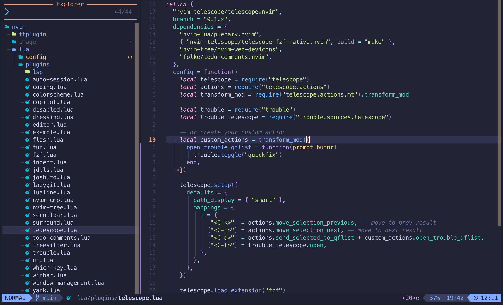
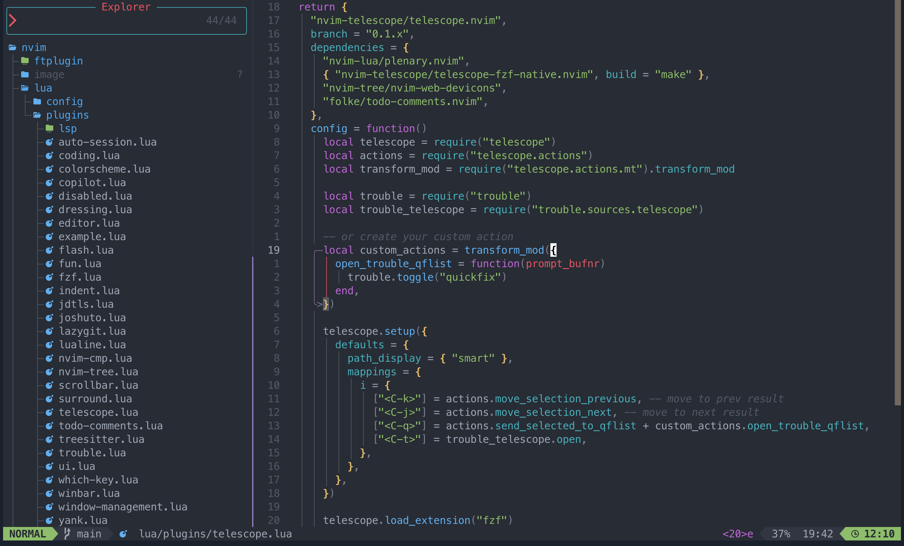
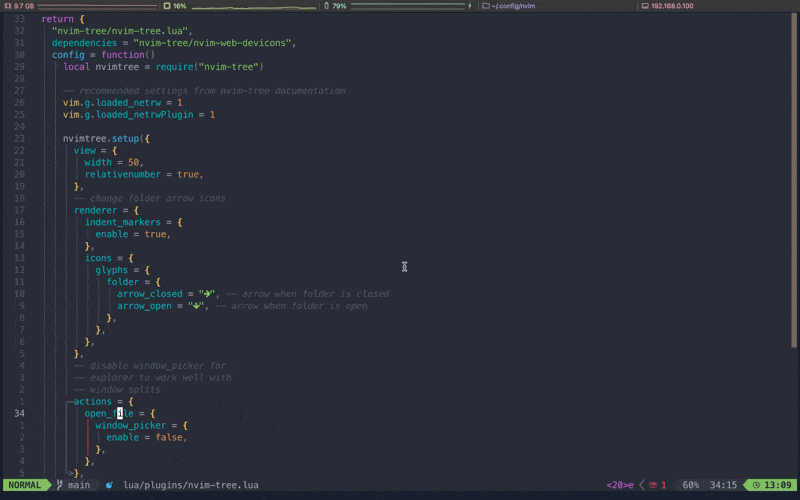
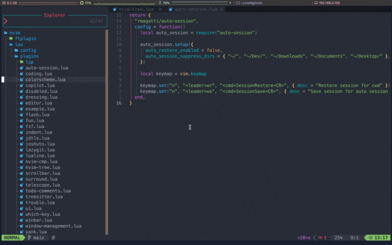
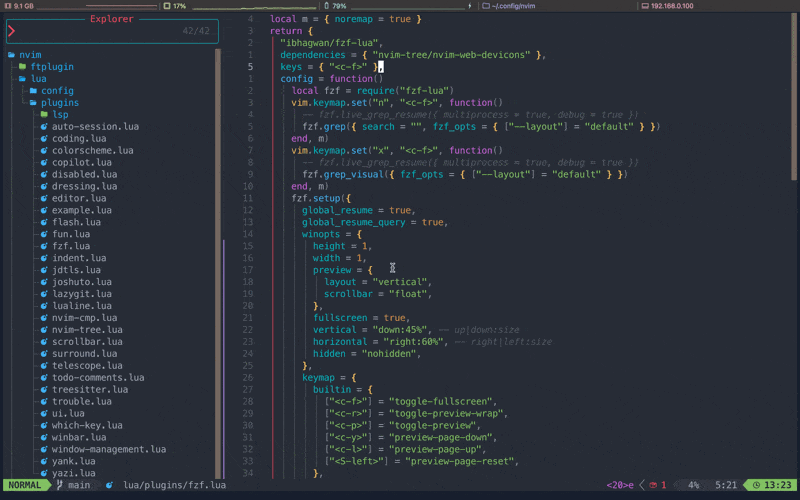
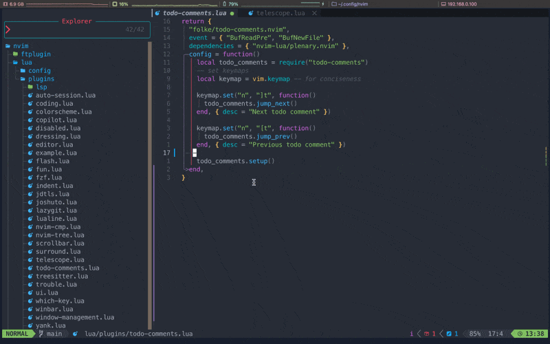

# *My LazyVim Configuration💤*
*Refer to the [documentation](https://lazyvim.github.io/installation) to get started.*

## A starter template for *[LazyVim](https://github.com/LazyVim/LazyVim).*
This is a my settings for LazyVim, a Neovim configuration that aims to provide a fast and efficient development environment. It includes essential plugins and configurations to enhance your coding experience.

## Requirements for [*LazyVim*](https://github.com/LazyVim/LazyVim)
- Neovim 0.9+
- Git 2.19.0+
- a [Nerd Font](https://www.nerdfonts.com/)*(optional)*

## Colorscheme Example
- [folke/tokyonight.nvim](https://github.com/folke/tokyonight.nvim)

## Plugins

### Preferred Colorscheme
- [navarasu/onedark.nvim](https://github.com/navarasu/onedark.nvim)

### Navigating Quickly
- [folke/flash.nvim](https://github.com/folke/flash.nvim)- provides a quick way to navigate through text.

### File Explorer
- [nvim-tree/nvim-tree.lua](https://github.com/nvim-tree/nvim-tree.lua) - file explorer for Neovim written in Lua.

### VS Code Like Icons
- [nvim-tree/nvim-web-devicons](https://github.com/nvim-tree/nvim-web-devicons)

### Auto Sessions
- [rmagatti/auto-session](https://github.com/rmagatti/auto-session) - automatically saves and restores sessions.

### Status Line
- [nvim-lualine/lualine.nvim](https://github.com/nvim-lualine/lualine.nvim) - better status line.

### Buffer Line
- [akinsho/bufferline.nvim](https://github.com/akinsho/bufferline.nvim) - better buffer line.

### Fuzzy Finder
- [nvim-telescope/telescope.nvim](https://github.com/nvim-telescope/telescope.nvim) - highly extendable fuzzy finder over lists.

- [ibhagwan/fzf-lua](https://github.com/ibhagwan/fzf-lua) - FZF integration for Neovim .

### Autocompletion
- [hrsh7th/nvim-cmp](https://github.com/hrsh7th/nvim-cmp) - completion engine plugin for Neovim written in Lua.
- [hrsh7th/cmp-buffer](https://github.com/hrsh7th/cmp-buffer) - buffer source for nvim-cmp.
- [hrsh7th/cmp-path](https://github.com/hrsh7th/cmp-path) - path source for nvim-cmp.

### LSP Configuration
- [williamboman/mason-lspconfig.nvim](williamboman/mason-lspconfig.nvim) - Bridges the gap between Mason and nvim-lspconfig.
- [neovim/nvim-lspconfig](https://github.com/neovim/nvim-lspconfig) - Easy way to configure lsp servers.
- [hrsh7th/cmp-nvim-lsp](https://github.com/hrsh7th/cmp-nvim-lsp) - Smart code autocompletion with lsp.

### Trouble.nvim
- [folke/trouble.nvim](https://github.com/folke/trouble.nvim) - pretty diagnostics, references, telescope results, quickfix and location list.

### Todo Comments
- [folke/todo-comments.nvim](https://github.com/folke/todo-comments.nvim) - Highlight, list and search todo comments.

### Treesitter Syntax Highlighting & Autoclosing 
- [nvim-treesitter/nvim-treesitter](https://github.com/nvim-treesitter/nvim-treesitter) - Treesitter configuration.
- [windwp/nvim-autopairs](https://github.com/windwp/nvim-autopairs) - Autoclose brackets, parens, quotes, etc...

### Git
- [kdheepak/lazygit.nvim](https://github.com/kdheepak/lazygit.nvim) - use lazygit within Neovim.